[MIT 6.824 (现6.5840) 通关记录 - 知乎 (zhihu.com)](https://zhuanlan.zhihu.com/p/631386296)

[MIT 6.824 - 知乎 (zhihu.com)](https://www.zhihu.com/column/c_1602038925551517696)

[Golang快速入门：从菜鸟到大佬 - wwwn - 博客园 (cnblogs.com)](https://www.cnblogs.com/wwwn/p/12804506.html)

------

## Lab 1: MapReduce

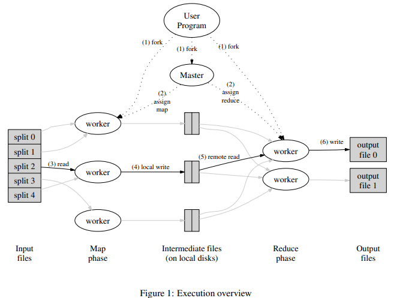

coordinator：实现任务调度，通过任务队列、任务申请函数等方法实现任务分配，通过计时器、任务提交函数等方法保证任务完成，通过检查结构体状态系统运行阶段进行不同任务的分配和关闭系统，通过上锁保证worker互斥地访问任务队列等资源。

worker：通过rpc循环向coordinator申请任务，根据返回值的任务类型、文件名以及reducer数量执行相应的任务，map任务将读取到的kv按照哈希分成nReduce个文件保存，reduce任务读取所有mr-n-*文件进行合并，每个任务完成后向coordinator提交。

rpc：定义rpc调用中的结构体参数类型。

> [MIT 6.824 (现6.5840) 通关记录 - 知乎 (zhihu.com)](https://zhuanlan.zhihu.com/p/631386296)
>
> [MIT 6.824 Lab1 MapReduce - 知乎 (zhihu.com)](https://zhuanlan.zhihu.com/p/601039547)
>
> [[翻译\]MapReduce: Simplified Data Processing on Large Clusters - 付哲 - 博客园 (cnblogs.com)](https://www.cnblogs.com/fuzhe1989/p/3413457.html)

## Lab 2: Raft

### Part 2A: leader election

> `labrpc` 包模拟了一个可能丢包的网络，其中服务器可能无法访问，请求和回复可能会丢失。`Call()` 发送请求并等待回复。如果在超时间隔内收到回复，`Call()` 返回 `true`；否则返回 `false`。因此，`Call()` 可能会等待一段时间才返回。`false` 的返回值可能由以下原因导致：服务器宕机、服务器无法访问、请求丢失或回复丢失。

**确保 `rf.heartbeats` 通道有足够的缓冲区**：

- 给 `rf.heartbeats` 通道添加缓冲区，以便在没有接收方时仍然可以发送心跳信号。
- `rf.heartbeats = make(chan bool, 1)`

**Leader因为网络问题断开连接**：

- 通过检测发送其他Follower心跳信号是否成功，判断自身网络状态
- 回退为Follower

**TODO：PreVote机制**

节点断开连接后，不断发起选举自增任期，重新连接后会扰乱系统

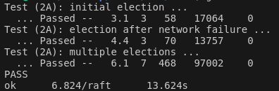

> [MIT 6.824 (现6.5840) 通关记录 - 知乎 (zhihu.com)](https://zhuanlan.zhihu.com/p/631386296)
>
> [MIT 6.824 Lab2A Raft：领导人选举 - 知乎 (zhihu.com)](https://zhuanlan.zhihu.com/p/601771466)
>
> [Raft的PreVote实现机制 - 腾讯云开发者社区-腾讯云 (tencent.com)](https://cloud.tencent.com/developer/news/232061)

### Part 2B: log

成为领导者后启动日志同步线程和commitIndex更新线程，通过定时器或条件变量控制其运行

每个server更新commitIndex后，需要向applyCh逐条传输log信息，以供测试脚本识别

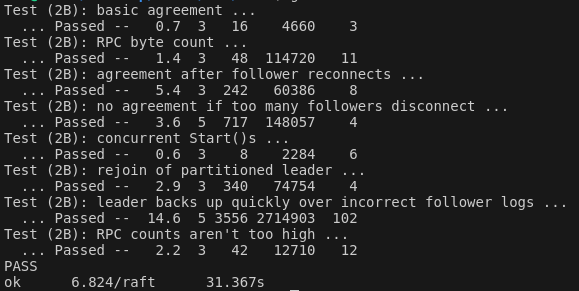

> [MIT 6.824 Lab2B Raft：日志复制 - 知乎 (zhihu.com)](https://zhuanlan.zhihu.com/p/602842850)

### Part 2C: persistence

#### **TestFigure82C**

图 8 展示了一种情况，一条已经被存储到大多数节点上的老日志条目，也依然有可能会被未来的领导人覆盖掉。

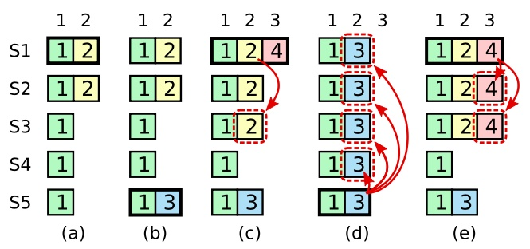

> 图 8：如图的时间序列展示了为什么领导人无法决定对老任期号的日志条目进行提交。在 (a) 中，S1 是领导人，部分的(跟随者)复制了索引位置 2 的日志条目。在 (b) 中，S1 崩溃了，然后 S5 在任期 3 里通过 S3、S4 和自己的选票赢得选举，然后从客户端接收了一条不一样的日志条目放在了索引 2 处。然后到 (c)，S5 又崩溃了；S1 重新启动，选举成功，开始复制日志。在这时，来自任期 2 的那条日志已经被复制到了集群中的大多数机器上，但是还没有被提交。如果 S1 在 (d) 中又崩溃了，S5 可以重新被选举成功（通过来自 S2，S3 和 S4 的选票），然后覆盖了他们在索引 2 处的日志。反之，如果在崩溃之前，S1 把自己主导的新任期里产生的日志条目复制到了大多数机器上，就如 (e) 中那样，那么在后面任期里面这些新的日志条目就会被提交（因为 S5 就不可能选举成功）。 这样在同一时刻就同时保证了，之前的所有老的日志条目就会被提交。

为了消除图 8 里描述的情况，Raft 永远不会通过计算副本数目的方式去提交一个之前任期内的日志条目。只有领导人当前任期里的日志条目通过计算副本数目可以被提交；具体来说，提交条件需要同时满足`count > len(rf.peers)/2 && rf.log[i].Term == rf.currentTerm`

在查找commitIndex时，之前写的二分存在问题，使用从后往前遍历方法

#### **TestFigure8Unreliable2C**

测试在高延迟RPC下的处理，会收到很多旧的消息，需要考虑对过期的老的RPC处理请求应该做出什么样的处理

1.日志不进行直接覆盖，只有RPC日志与自身日志不匹配，才能将后续日志删除并更新，防止接收到旧的RPC导致日志缩短

> 如果现有条目与新条目冲突（索引相同但任期不同），请删除现有条目及其后面的所有条目。
> 这里的if是至关重要的。如果跟随者拥有引导者发送的所有条目，则跟随者不得截断其日志。必须保留领导者发送的条目之后的任何元素。这是因为我们可能会收到来自领导者的过时RPC，而截断日志意味着“收回”我们可能已经告诉领导者我们日志中的条目。

2.在PrevLogTerm不匹配时，通过一次性越过冲突任期，reply中返回NextIndex；在不匹配重试情况下，NextIndex只能递减；AppendEntries成功的NextIndex和失败的NextIndex可能存在冲突

***以上方法在Leader与Follower的日志存在较多的不一致情况下，仍然需要多次RPC重试，其在不可靠RPC环境下较难快速达成一致，且在TestFigure8Unreliable2C实验中较为频繁的Leader切换，让实现日志的一致性更加看脸*** ==更新：失败原因为代码逻辑写错导致阻塞，见下文==

通过基于分块的方法返回Follower的日志切片，Leader在其中找到任期一致的日志Index作为NextIndex，实现一次RPC重试就能完成同步

3.在接收心跳RPC的返回时，同样需要执行指定的任意检查

> 我们的许多学生认为心跳在某种程度上是“特殊的”；当对等端接收到心跳时，它应该将其与非心跳RPC区别对待。特别是，许多人只需在收到心跳时重置他们的选举计时器，然后返回成功，而不执行图2中指定的任何检查。这是极其危险的。通过接受RPC，跟随者隐含地告诉引导者，他们的日志与引导者的日志匹配，直到并包括参数中包含的。收到回复后，领导者可能会（错误地）决定某些条目已复制到大多数服务器，并开始提交。AppendEntriesprevLogIndexAppendEntries

4.**之前实验中的实现存在问题，与论文细节不符：**

- 节点超时发起选举时，重置自己的选举超时计时器；任期落后时，更新并重置计时器
- 如果对于一个跟随者，最后日志条目的索引值大于等于 nextIndex（`lastLogIndex ≥ nextIndex`），则发送从 nextIndex 开始的所有日志条目（判断nextIndex而不是matchIndex）
- 如果领导人的已知已提交的最高日志条目的索引大于接收者的已知已提交最高日志条目的索引（`leaderCommit > commitIndex`），则把接收者的已知已经提交的最高的日志条目的索引commitIndex 重置为 领导人的已知已经提交的最高的日志条目的索引 leaderCommit 或者是 **上一个新条目的索引**（而不是日志最后条目的索引） 取两者的最小值
- commitIndex只能增加不能减小，因此在重置为**上一个新条目的索引**时要再次判断
- 任何带有长时间运行循环的goroutine应该调用killed()来检查它是否应该停止。

##### unreliable原理：

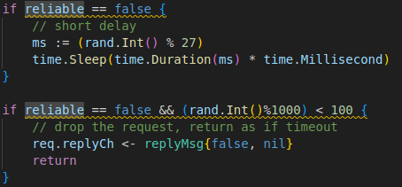

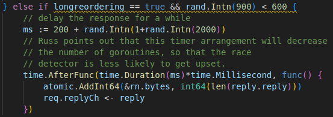

##### 失败原因：

之前的同步日志/发送心跳实现为，领导者对每个跟随者单独开一个线程，在线程中进行发送RPC、等待RPC、处理RPC、睡眠的循环。看似是多线程+等待RPC时解锁，**实际上对于每个跟随者的RPC循环是阻塞的**，需要等待接收延迟+睡眠时间才能进行下一次RPC循环，与每隔固定时间发送RPC的设计不符，造成不能及时同步日志/发送心跳。

##### 修改：

细化封装同步日志/发送心跳循环，领导者启动一个循环RPC线程，线程中每隔固定时间对每个跟随者启动进行一次RPC的线程，包含发送RPC、等待RPC、处理RPC。

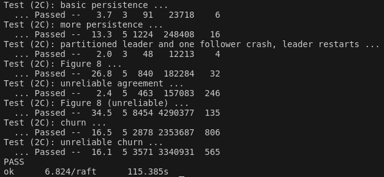

> [MIT 6.824 Lab2C：Raft 日志持久化 - 知乎 (zhihu.com)](https://zhuanlan.zhihu.com/p/603432276)
>
> [Students' Guide to Raft :: Jon Gjengset (thesquareplanet.com)](https://thesquareplanet.com/blog/students-guide-to-raft/)

### Part 2D: log compaction

节点的各个状态采用绝对索引记录，使用`rf.log`及其长度等数据时采用相对索引，两者通过`lastsnapshotIndex`转换。在使用相对索引时，对索引是否越界进行判断，并采取传递快照解决不同步问题，需要传递快照的场景有：附加日志不匹配时回溯到快照位置、发起同步日志/发送心跳时跟随者的`nextIndex`已经存在快照中。

系统在接收到要提交的日志后，如若需生成快照，则会调用`Snapshot` 函数，然后再返回，所以在这个过程中，向`applyCh` 发送消息，不能拥有锁，否则会发生死锁

程序调试：

- 执行快照的时候，确保快照最后日志即`rf.log[0]`的任期正确。快照索引大于等于日志最后索引时，初始化日志；快照索引小于日志最后索引、大于上次快照索引时，更新日志为缩减后的。
- 发起RPC获得锁后，判断自身状态是否合法，不合法放弃RPC。

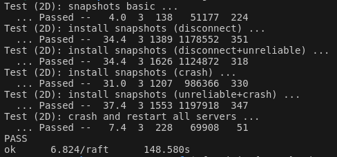

> [MIT 6.824 Lab2D：Raft 快照机制 - 知乎 (zhihu.com)](https://zhuanlan.zhihu.com/p/604069871)

实验2测试30次通过

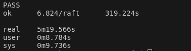

## Lab 3: Fault-tolerant Key/Value Service

### Part A: Key/value service without snapshots

##### 线性化语义

原方案：client在准备发送一条命令的时候生成一个随机数作为该命令的ID，在命令被成功执行前所有重复尝试都以这个数作为ID。server在执行命令后将随机数储存在哈希表中，后续在执行命令前查表，若存在则跳过执行；哈希表定期清理。不足：哈希表清理阈值100以上大概能满足使用需求，但在3B测试中哈希表占快照空间过大2000>500

更新后方案：每一个client生成一个随机数作为自己的ID，再通过一个递增的数字作为命令的序列号，两个数字确定一条命令；server执行一个命令后记录下该client的序列号，小于序列号的命令视为重复。不足：随着client的增多或重启，clientId字段不断增加占用内存，可能需要client发送心跳信号以维持对应字段数据的存在

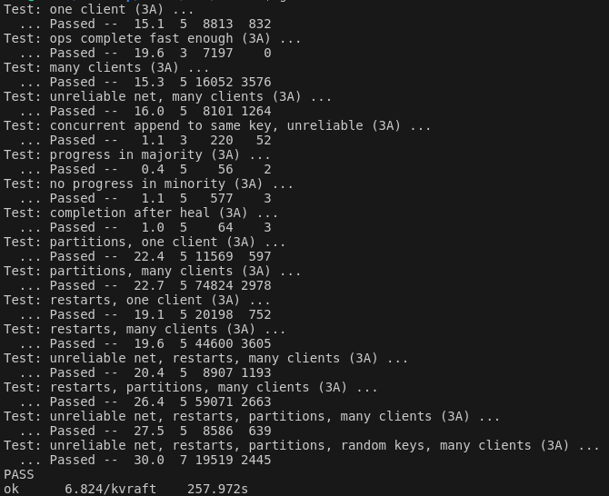

### Part B: Key/value service with snapshots

生成快照不应该与接收一致化日志在同一函数中进行，会导致持久化内容一过阈值就需要生成快照，拖慢阻塞接收日志；而应该通过独立线程每隔一段时间检测生成快照，在输入日志量大的情况下，一次性生成最新快照

快照需要保存线性化语义所需数据结构，以防崩溃重启后线性化语义失败

此外在raft中修改了快照中的条件判断，增加索引与日志长度相同时的条件，重新测试2D通过

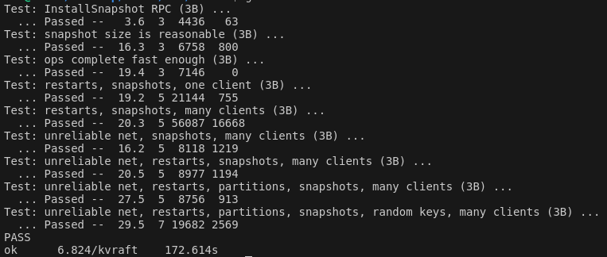

> [MIT 6.824 Lab3，Lab4A - 知乎 (zhihu.com)](https://zhuanlan.zhihu.com/p/609273507)

## Lab 4: Sharded Key/Value Service

### Part A: The Shard controller

目标构建类似Lab3B的分布式存储系统记录Config，操作方式变为Join、Leave、Move、Query，需要解决问题为加入和离开后group的shards平衡，group中的`gid -> servers[]`只需按操作存储和删除。主要思路通过贪心求出哪些组释放以及哪些组接收shard，注意释放和接收不同shards顺序要确定，否则多个server在同一操作后的Config将不同

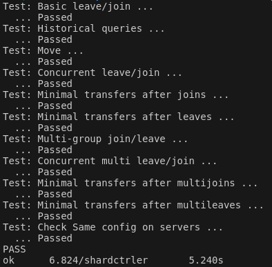

> [MIT-6.824-lab4A-2022(万字讲解-代码构建）_mit6.824 lab4-CSDN博客](https://blog.csdn.net/weixin_45938441/article/details/125386091)
>
> [MIT6.824-lab4A-The Shard controller(基于Raft的Shard KV数据库-分片控制器)_6.824lab4 shardkv-CSDN博客](https://blog.csdn.net/qq_44766883/article/details/126430294?spm=1001.2101.3001.6650.4&utm_medium=distribute.pc_relevant.none-task-blog-2~default~BlogCommendFromBaidu~Rate-4-126430294-blog-125386091.235^v43^pc_blog_bottom_relevance_base4&depth_1-utm_source=distribute.pc_relevant.none-task-blog-2~default~BlogCommendFromBaidu~Rate-4-126430294-blog-125386091.235^v43^pc_blog_bottom_relevance_base4&utm_relevant_index=9)

### Part B: Sharded Key/Value Server

每个Server维护保存`config`和`ownedShards[]`，前者保存配置信息，后者表示当前实际的shard存在状态。在接收Client的RPC时不对相应信息进行检查，因为server的配置信息的更新同样通过raft一致化，此刻信息不匹配不代表在应用时不匹配；而是在apply操作时检查实际shard是否存在以及configId是否一致，一旦检查有误则返回ErrWrongGroup

shardKV中每个group的配置更新由各自的Leader负责，在更新配置前需检查当前配置是否已经完成，即`config`和`ownedShards[]`一致。更新配置中所有权的变更有几种：持有权不变、不持有、转移、无人持有->新持有，分别对应三种操作：`LeaveShard`、`MoveShard`、`JoinShard`，组内数据需要保持一致性因此shard操作需要通过raft实现。在server收到raft的op后，LeaveShard和JoinShard分别删除和添加对应的shard数据并修改ownedShards；MoveShard则需要修改ownedShards并给目标group的Leader发送包含shard数据的RPC，目标server再将shard数据作为JoinShard操作输入raft。此外`config`的更新同样需要通过raft同步到其他server上。

客户端在接收到`ErrWrongGroup`不应该改变序列号。因为当设计为更新序列号，且客户端只有在接收ErrWrongGroup时才会重询并自增序列号，ErrWrongGroup对应的操作RPC可能返回丢失，服务端认为ErrWrongGroup后不会接收到相同序列号的操作，那么客户端重新发送的相同序列号的操作就会被认为重复执行，从而返回执行成功而实际不执行，丢失了数据。再考虑一种情况，客户端在尝试一轮server没有成功后就重询config更新序列号，此时若RPC调用成功却返回丢失，客户端自增序列号将重复append。实际可行方案为客户端不改变序列号，而服务端在ErrWrongGroup后将已接收的序列号减一。

#### TestConcurrent1

调试中出现重复Append问题，调整测试条件后发现重复append只会出现在server的重启之后。打印日志后发现重复append是在shard转移前后在不同group进行的，问题在于append在符合配置条件时会成功执行并实现线性化语义并返回成功，即使没有成功返回client也会在下次请求返回OK；只有在不符合配置条件的情况下返回信息给client，client才会尝试更新配置并向其他group尝试，即重复向不同group进行append的前提是前一次append失败，因而出现的bug与预期分析结果出现冲突，寄！😭😭😭

深入模拟了一遍重启后命令的提交，得出了一种程序的可能性：程序重启后将继续应用日志中的操作，日志中此时可能包含两条相同内容而ConfigId不同的操作，前面的操作因为ConfigId更旧因此返回了ErrWrongGroup，且因为client同时也请求了RPC，该旧操作通过此时的RPC通道返回ErrWrongGroup给client，而日志中新的操作恰好符合此时的配置条件从而执行；此时若config又进行了一次更新，将对应的shard转移到另一group，原先接收到ErrWrongGroup的client就会将该操作转发给新的group，新group则再次执行命令从而造成重复append。本质在于旧操作的结果通过新调用RPC的通道传出，从而同一个操作在两个group先后进行。

这种情况在尝试过程中发现一种方法，是在apply操作时，不对`kv.config.Num == op.ConfigId`检查是否匹配，只要server的`kv.ownedShards[op.ShardId]`为真，即此时server实际持有shard的所有权，就进行apply操作。这种方法治标不治本，只对该测试点情况有效，在TestConcurrent3会再次出现重复append。比较简单彻底的解决办法是在shard转移时同时对新group更新`Clientseq`。

测试20次通过

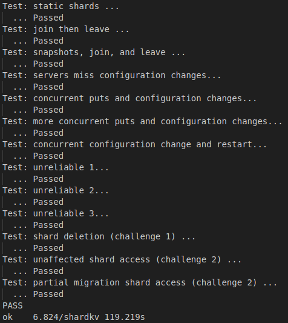

## 后记

累累累累累累 

没提前把实现功能的整个逻辑梳理完善就开动，结果就是debug到秃头

> Think twice, code once.
